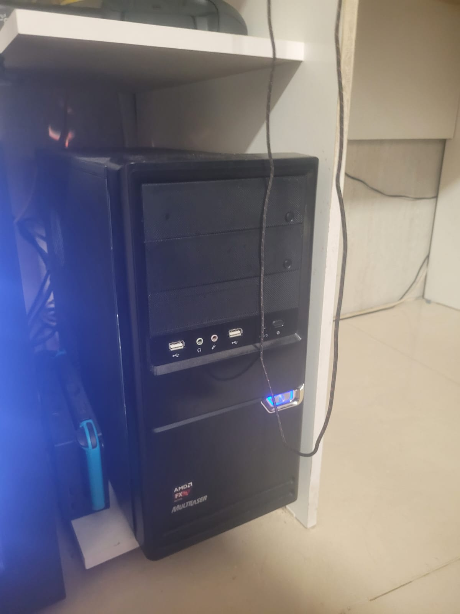

# InovaApps 2026

Plataforma **multi-tenant** de gestão de carteira de clientes, saúde da conta e priorização de atendimento, desenvolvida para o desafio **INOVAAPPS 2026** (enunciado e base de exemplo na pasta [`dados/`](dados/)).

Cada empresa faz login no seu próprio contexto, envia sua planilha de clientes, configura pesos e limites de risco e vê um painel com o índice de atenção, exposição financeira e fila de atendimento, com tema visual próprio e um assistente de IA isolado por empresa.

---

## ✨ Funcionalidades

**Plataforma e acesso**
- **Multi-tenancy:** cada usuário pertence a uma empresa (`company_id`); dados, chat e configurações são isolados. Detecção opcional da empresa por subdomínio.
- **Login e cadastro** de empresa, com bloqueio por tentativas (10 erros em 15 minutos por e-mail), cabeçalhos de segurança, HSTS em HTTPS e proteção contra upload de arquivos inesperados.
- **Tema por empresa:** cores, fonte e logo próprios (com cores sugeridas a partir da logo), favicon e tela de login do Seer.
- **Carregamento com esqueleto** nos gráficos e seções enquanto renderizam.

**Dados e métricas**
- **Importação de planilhas** (XLSX/CSV) com várias abas ligadas por `cliente_id`, dicionário de campos e tela de confirmação em cartões. Arquivos grandes (> 2 MB) rodam em fila.
- **Modelo de planilha em XLSX** (Leia-me, dicionário e abas de dados) para baixar.
- **Métricas próprias por empresa,** com tela de cartões recolhíveis e 8 tipos (decimal, inteiro, percentual, monetário, binário, nota, data e texto), direção de piora, faixas, peso e ativação. Mudar qualquer valor recalcula a carteira.
- **Colunas opcionais:** `segmento` e `plano` (viram "Não informado"), `situacao`, `mes_cancelamento` e `inicio_contrato` (reconhecem quem cancelou).
- **Sinais extras do desafio** (chamados críticos, tempo de resolução e volume de chamados) entram no cálculo quando a base tem esses dados.

**Análise**
- **Índice de atenção** de 0 a 100 (não é probabilidade de cancelamento), explicável, com níveis Baixo/Médio/Alto/Crítico.
- **Fila de atendimento** em dois grupos, com prazo de contato pela posição e cliente **marcado como resolvido** (vai para o fim da fila).
- **Painel** em abas (Visão geral, Gráficos e Por segmento): KPIs, clientes por nível, risco por segmento, uso × SLA e comparação com cancelados.
- **Validação com cancelados** (backtest) e **relatório de evidências em PDF** que funciona para qualquer empresa, com ou sem os 8 sinais padrão.
- **Notificações** de clientes que pioraram.

**Assistente de IA**
- **Chat** por empresa, opcionalmente focado em um cliente: API da NVIDIA (prioridade), Ollama local e respostas por regras como último recurso.
- **Conversa por voz** com voz neural (Edge TTS) e respostas menos formais, e **Libras:** o avatar do VLibras sinaliza as respostas da IA.
- **Acessibilidade:** widget VLibras, tamanho de texto ajustável e navegação por comando de voz.

## 📊 Métricas por empresa

Cada empresa tem o seu próprio conjunto de métricas, definido a partir da base que ela envia. No envio da planilha, cada coluna nova é mapeada para uma métrica existente ou cadastrada como nova (também dá para cadastrar em Configurações). A métrica guarda nome, descrição, tipo, direção de piora, valores saudável e crítico e peso. Alterar peso, faixa ou estado recalcula a atenção da carteira.

Em **Configurações › Prioridades** (só na empresa base, a que tem os 8 sinais padrão do desafio, a Globalsys) fica **uma lista única** de prioridade: os 8 sinais padrão e as métricas acrescentadas depois, todos arrastáveis. O que fica no topo pesa mais, e **"Editar pesos"** define o peso de cada posição (11 posições com as 3 métricas extras). Mudar o peso de uma métrica na aba **Métricas** também a reposiciona nessa lista. As demais empresas usam só a aba **Métricas**.

Em **Configurações › Métricas**, as métricas cadastradas aparecem em cartões recolhíveis (nome, tipo, estado e resumo da faixa): é só abrir o cartão para editar. Os sinais padrão e as métricas da empresa entram na **mesma conta** (média ponderada pelos pesos), então ligar uma métrica nova reduz a participação relativa dos demais.

Chamados críticos, tempo médio de resolução e volume de chamados abertos foram **acrescentados depois** dos 8 sinais padrão, como métricas da empresa. Eles vêm da base do desafio e são ativados na importação (ou com `php artisan seer:ativar-sinais-extras`, para bases já importadas), com faixas e pesos iniciais editáveis.

| Tipo | Como o valor é lido | Entra na atenção? |
|---|---|---|
| Número decimal | Número com casas decimais (`12,5`) | Sim |
| Número inteiro (contagem) | Só inteiros (`3`) | Sim |
| Percentual | 0 a 100, com ou sem `%` | Sim |
| Valor monetário | Aceita `R$ 1.200,50` | Sim |
| Binário | `0` ou `1` (também `sim`/`não`) | Sim |
| Nota | 0 a 10 | Sim |
| Data | `AAAA-MM-DD` ou `DD/MM/AAAA`, guardada como `AAAA-MM-DD` (útil para data de início e de fim) | Não |
| Texto | Até 1000 caracteres | Não |

### Modelo de planilha

Em **Planilha** há o modelo completo em XLSX, no formato da base do desafio: uma aba **Leia-me** com as instruções, um **dicionário** dos campos e abas de dados (`clientes` e `metricas_mensais`). Dá para usar quantas abas quiser, desde que todas tenham a coluna `cliente_id`: abas com `mes_ref` são mensais e abas sem ele valem para todos os meses do cliente (a mesma coluna não pode aparecer em duas abas).

Colunas obrigatórias: `cliente_id`, `mes_ref`, `porte` e `valor_mensal`. **`segmento` e `plano` são opcionais** (sem eles, ficam como "Não informado"). As colunas `situacao` (Ativo ou Cancelado), `mes_cancelamento` (AAAA-MM) e `inicio_contrato` não viram métricas: definem quem cancelou (o histórico e o cálculo param no mês anterior ao cancelamento) e o início do contrato. Sem elas, todos entram como ativos e a validação com cancelados não funciona.

Se o dicionário vier preenchido (`campo`, `tipo`, `descricao` e, para métricas que entram na atenção, `piora_quando`, `valor_saudavel`, `valor_critico` e `peso`), as métricas já chegam configuradas na tela de confirmação. O dicionário da base do desafio também funciona: os tipos (Inteiro, Decimal (%), Binario 0/1, Data...) e as descrições são lidos dele.

Valores vazios são aceitos: o mês fica no histórico sem aquela métrica. Métricas de tipo Data e Texto aparecem no histórico do cliente, mas ficam fora do cálculo.

## 🧱 Stack

PHP 8.3+ · Laravel 13 · Filament 5 · Livewire 4 · Tailwind CSS 4 · Vite 8 · OpenSpout (XLSX) · DomPDF · SQLite (padrão) · PHPUnit 12

---

## 🧮 Como a Atenção é calculada

A **Atenção** é um índice de **0 a 100** que diz o quanto um cliente precisa de contato. **Não é a probabilidade de cancelar**: ela ordena o atendimento. É calculada por regras fixas, sem IA, então o resultado é sempre o mesmo para os mesmos dados e dá para explicar cada ponto.

1. **Janela e mediana.** Para cada cliente, o sistema usa os **3 últimos meses** e tira a **mediana** de cada sinal. Assim, uma piora de um mês só não pesa.
2. **Severidade (0 a 1) por sinal.** Cada sinal vira uma nota: 0 é saudável e 1 é crítico.

| Sinal padrão | Peso | Severidade |
|---|---|---|
| Uso da plataforma | 20 | (85 − uso%) ÷ 35 |
| SLA cumprido | 15 | (85 − SLA%) ÷ 45 |
| Satisfação (NPS) | 15 | metade da nota `(8 − nota) ÷ 6` e metade das pesquisas sem resposta |
| Reuniões realizadas | 12 | (0,8 − realizadas ÷ previstas) ÷ 0,6 |
| Reincidência de chamados | 10 | (reabertos ÷ abertos) ÷ 0,25 |
| Reclamações formais | 10 | reclamações em 3 meses ÷ 4 |
| Atraso de pagamento | 10 | dias de atraso ÷ 10 |
| Tendência de queda | 8 | queda do uso frente ao início do histórico ÷ 30 p.p. |

   Toda severidade fica entre 0 e 1. Métricas próprias da empresa seguem a mesma ideia: `(valor − saudável) ÷ (crítico − saudável)`, limitado entre 0 e 1.
3. **Média ponderada.** `Atenção = soma(severidade × peso) ÷ soma(pesos) × 100`, arredondada. Os pesos, a ordem de prioridade e as métricas ativas são configuráveis por empresa; mudar qualquer um recalcula a carteira.
4. **Nível.** Baixo (abaixo de 25), Médio (25 a 39), Alto (40 a 54) e Crítico (55 ou mais). Os cortes também são configuráveis. Médio, Alto e Crítico estão **em alerta**.
5. **Fila de atendimento.** Primeiro quem está em alerta, depois os demais. Dentro de cada grupo, a ordem é `atenção × (atenção + K) × valor mensal do contrato`, com **K = 50** por padrão. O contrato grande desempata, mas nunca põe alguém sem alerta na frente de alguém em alerta. Clientes marcados como resolvidos vão para o fim, e os cancelados ficam por último.
6. **Prazo de contato** (capacidade de 3 contatos por dia): posições 1 a 3 "contato hoje", até 9 "em até 3 dias", até 15 "esta semana", os demais no ciclo normal.
7. **Exposição mensal** = `atenção ÷ 100 × valor mensal`. É um indicador para comparar, não uma perda prevista.
8. **Clientes parecidos com cancelados.** O sistema compara o perfil de severidades do cliente com o de quem cancelou e mostra os mais semelhantes.
9. **Validação.** A tela de evidências e o relatório em PDF mostram, com os cancelados da própria base, quais sinais separam quem saiu de quem ficou, e o Configurador sugere pesos e cortes a partir disso.

Detalhes e exemplos numéricos: [Guia funcional do painel](docs/GUIA-FUNCIONAL-DO-PAINEL.md).

## 🤖 IA: consumo, segurança e como desligar

- **A IA não calcula a atenção.** Ela só explica os resultados em texto (chat, relatório e configuração recomendada). Sem IA, o núcleo do produto funciona igual.
- **Ordem de uso:** API da NVIDIA → Ollama (modelo local no servidor) → respostas por regras.
- **Ressalva sobre a API da NVIDIA.** O Seer usa a API do [build.nvidia.com](https://build.nvidia.com), que é **gratuita para desenvolvimento, testes e prototipagem**, com limite de requisições e sem garantia de disponibilidade. Por isso ela é a primeira opção, mas nunca a única: se a chave não existir, o limite estourar ou a resposta vier fraca, o sistema usa o Ollama e, por último, respostas por regras. Para uso comercial em produção, confirme os termos e os planos da NVIDIA antes de depender dela, ou use só o Ollama local (sem custo e sem enviar dados para fora).
- **Consumo:** baixo por desenho. A ideia é um usuário compartilhado por empresa, que acompanha os problemas da própria carteira, então poucas pessoas usam o assistente ao mesmo tempo, e cada pergunta leva só um resumo. Um servidor comum, sem nada de sofisticado, já sustenta a IA local (Ollama), sem depender de serviço pago. Conforme as empresas crescerem, as chamadas ao Ollama podem passar por uma fila de jobs. Detalhes em [docs/IA-CUSTO-E-SEGURANCA.md](docs/IA-CUSTO-E-SEGURANCA.md).
- **Segurança:** só um resumo dos dados da própria empresa é enviado; a IA não escreve nem executa nada; tentativas de manipular o assistente são barradas; a resposta é sanitizada; a chave da API fica só no servidor; a conversa não é gravada no banco.
- **A empresa pode desligar a IA** em **Configurações › Assistente de IA**. Desligada, nada sai do servidor e o chat responde às **perguntas prontas por regras**, usando os dados reais da carteira da empresa, calculados localmente (não são dados de exemplo). O operador também pode desligar para todas com `LLM_ENABLED=false`.

## 🧩 Engenharia de software

Requisitos, **casos de uso**, **diagramas de classes** (domínio e serviços), **diagrama de banco de dados (ER)**, fluxos de importação e de chat e decisões de projeto estão em [docs/ENGENHARIA-DE-SOFTWARE.md](docs/ENGENHARIA-DE-SOFTWARE.md).

## 🌐 Site no ar

Está publicado em **https://sitedemerda.com.br**.

O nome do domínio **não é proposital**. Era um domínio que um dos membros do time já tinha e usava para subir aplicações de teste. Para colocar o Seer em produção rápido, sem gastar tempo com registro e configuração de DNS de um domínio novo, a gente reaproveitou esse.

## 🖥️ Onde o site roda

O Seer roda em um servidor físico próprio, um PC de mesa (gabinete Multilaser) ligado à rede local. O domínio aponta para ele por um proxy reverso (Nginx Proxy Manager) com HTTPS.



| Item | Especificação |
|---|---|
| Processador | Intel Core i5-9400F @ 2,90 GHz (6 núcleos) |
| Memória RAM | 8 GB (7,7 GiB úteis) |
| Armazenamento | SSD NVMe de 240 GB (223,6 GiB) |
| Sistema operacional | Ubuntu 24.04.5 LTS |
| PHP | 8.4 (`php artisan serve` com 4 workers, mais `queue:work`, ambos via `nohup`) |

## ▶️ Como rodar

O código Laravel fica em [`app/`](app/). O passo a passo de instalação (dependências, `.env`, banco, build, dados de demonstração e testes) está em **[app/README.md](app/README.md)**.

Resumo:

```bash
git clone https://github.com/MatheusIngles/InovaApps2026.git
cd InovaApps2026/app
composer setup
php artisan db:seed
composer dev      # http://localhost:8000
```

Contas de demonstração (só para desenvolvimento; o seeder se recusa a rodar em produção):

| Usuário | Senha | Empresa |
|---|---|---|
| `admin@inova.com` | `senha12345senha` | Globalsys (base do desafio) |
| `demo@inova.com` | `senha12345senha` | Globalsys (base do desafio) |
| `admin@beta.com` | `senha12345senha` | Beta (vazia, para testar o envio de planilha) |

## 🗂️ Estrutura

```
InovaApps2026/
├── dados/                              # dados do desafio e de teste
│   ├── Desafio - INOVAAPPS 2026.pdf    # enunciado
│   ├── INOVAAPPS_base_de_dados.xlsx    # base de exemplo (seeder e testes)
│   ├── exemplo_planilha.csv            # planilha pequena para testar a importação
│   └── globalsys-logo.jpg              # logo da Globalsys (aplicada pelo seed)
├── docs/
│   ├── ARQUITETURA-E-FUNCIONAMENTO.md  # camadas, modelo de dados, limitações
│   ├── GUIA-FUNCIONAL-DO-PAINEL.md     # como cada número do painel é calculado
│   ├── ENGENHARIA-DE-SOFTWARE.md       # requisitos, casos de uso, classes, banco de dados (ER), fluxos e rotas
│   ├── IA-CUSTO-E-SEGURANCA.md         # consumo da IA, segurança e como desligar
│   ├── MODELO-DE-NEGOCIO.md
│   ├── checklist-do-desafio.md
│   └── imagens/                        # foto do servidor
├── .github/workflows/deploy.yaml       # deploy automático via SSH
└── app/                                # projeto Laravel (veja app/README.md)
    ├── app/Filament/                   # Painel, Planilha, Configurações, Assistente, Empresas, Login
    ├── app/Livewire/                   # AssistenteChat, ImportarPlanilha, RelatorioEmpresa, MetricDefinitions
    ├── app/Jobs/                       # importação e relatórios em fila
    ├── app/Models/                     # Company, Customer, MetricDefinition, MetricValue, RiskAssessment...
    ├── app/Support/
    │   ├── Risco.php, RiskService.php  # cálculo da atenção e recálculo da carteira
    │   ├── Metricas/                   # MetricRisk (métricas próprias) e SinaisExtras
    │   ├── Import/                     # leitura de planilhas, dicionário e importação dinâmica
    │   ├── Llm/                        # IA: cascata, contexto, escopo e perguntas prontas
    │   ├── Validacao/                  # backtest e configurador
    │   └── Relatorio/, Notificacoes/, Tenancy/
    ├── app/Http/Middleware/            # contexto da empresa e cabeçalhos de segurança
    ├── app/Console/Commands/           # seer:ativar-sinais-extras
    ├── database/{migrations,seeders}
    └── tests/
```

## 📚 Documentação

- [Arquitetura e funcionamento](docs/ARQUITETURA-E-FUNCIONAMENTO.md): camadas, modelo de dados, limitações conhecidas.
- [Guia funcional do painel](docs/GUIA-FUNCIONAL-DO-PAINEL.md): como cada métrica, peso e nível é calculado.
- [Engenharia de software](docs/ENGENHARIA-DE-SOFTWARE.md): requisitos, casos de uso, diagramas de classes, diagrama de banco de dados (ER), fluxos e rotas.
- [IA: consumo e segurança](docs/IA-CUSTO-E-SEGURANCA.md): consumo, riscos e como desligar.
- [Modelo de negócio](docs/MODELO-DE-NEGOCIO.md)
- [Checklist do desafio](docs/checklist-do-desafio.md): requisitos e status.

## 🚢 Deploy

Push na `main` dispara [`deploy.yaml`](.github/workflows/deploy.yaml): conecta ao servidor via SSH, faz `git pull`, `composer install --no-dev`, `npm ci && npm run build`, `php artisan migrate --force`, `optimize` e recarrega o serviço. Requer os secrets `SERVER_HOST`, `SERVER_USER`, `SSH_PRIVATE_KEY` e `SUDO_PASSWORD`.

## ♿ VLibras

O widget do [VLibras](https://www.gov.br/governodigital/pt-br/vlibras) (Governo Federal) traduz o conteúdo para Libras. Carrega os assets de `vlibras.gov.br`, portanto exige internet.

## 🔗 Links úteis

[Laravel](https://laravel.com/docs) · [Filament](https://filamentphp.com/docs) · [Livewire](https://livewire.laravel.com) · [Tailwind CSS](https://tailwindcss.com/docs) · [Ollama](https://ollama.com)
