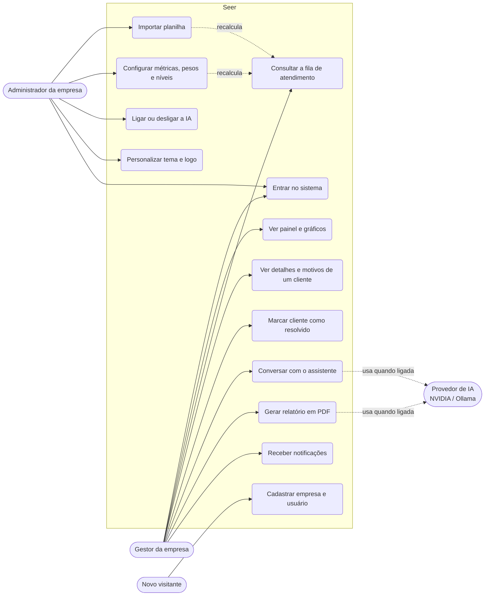
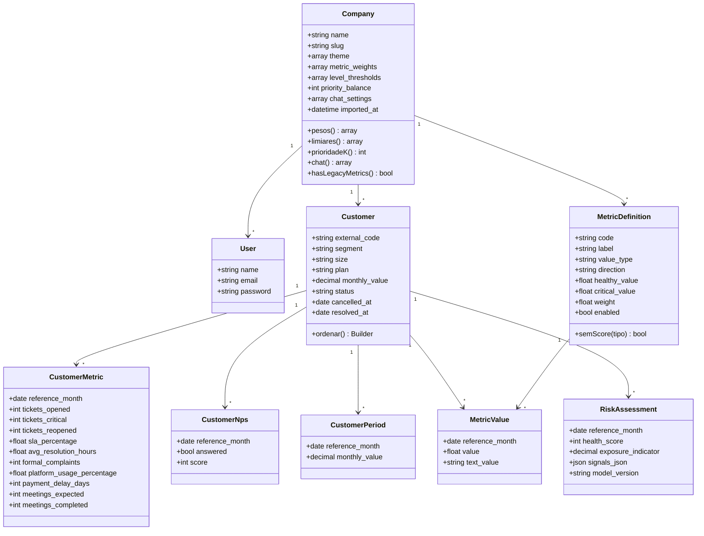
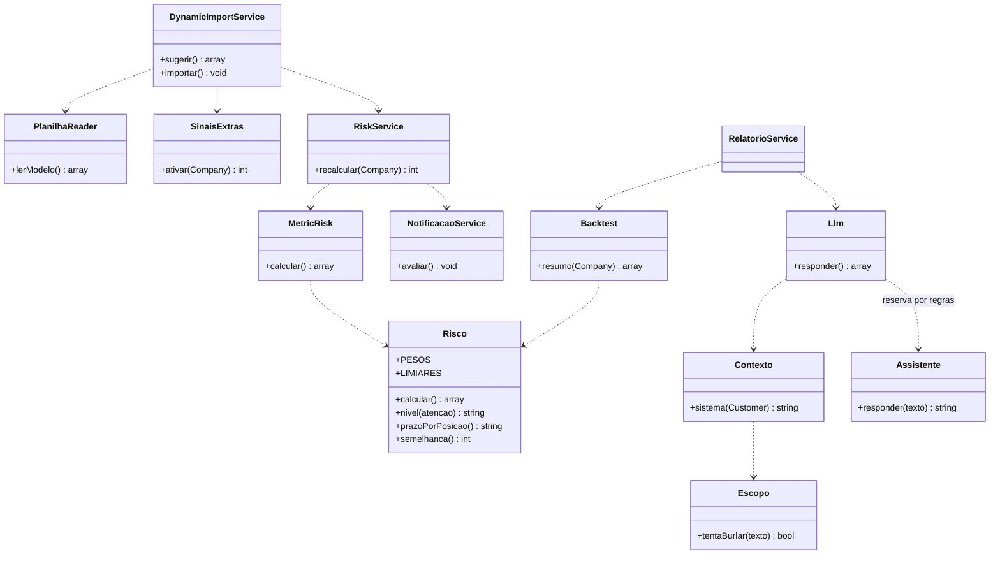
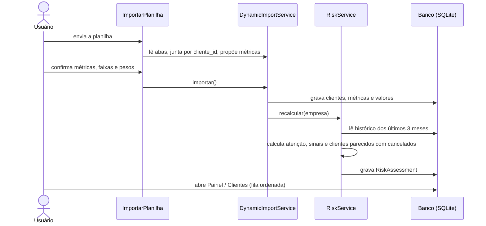
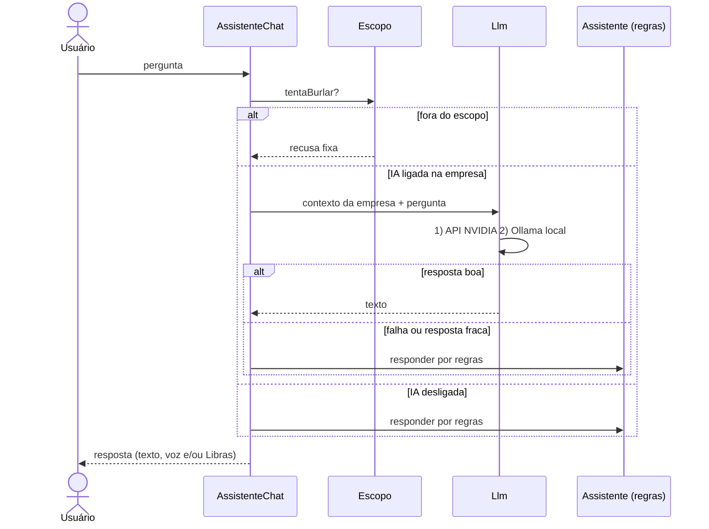
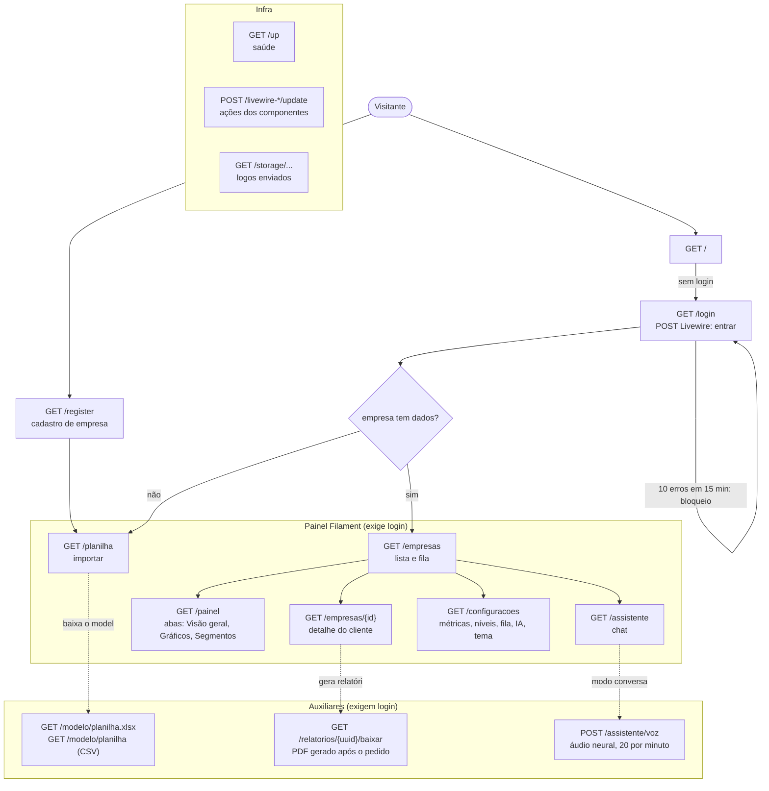
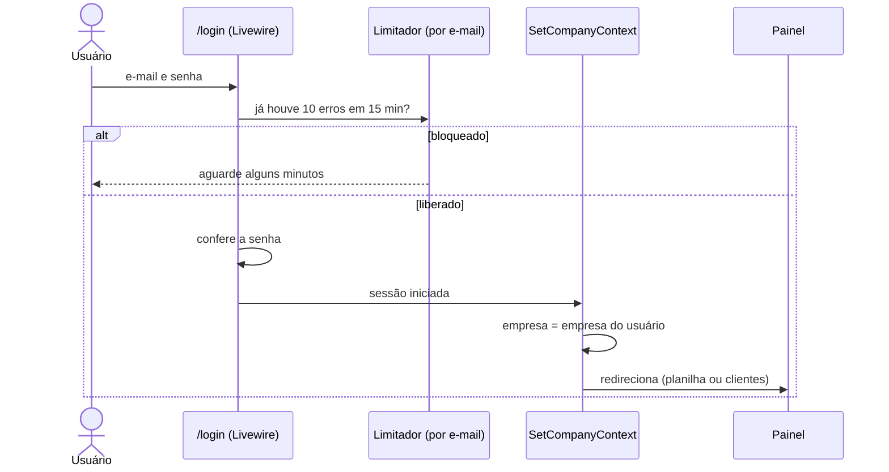

# Engenharia de software do Seer

Diagramas e decisões de projeto. Os diagramas usam [Mermaid](https://mermaid.js.org/), que o GitHub desenha direto no navegador. Os nomes seguem o código (`app/Models`, `app/Support`).

## 1. Requisitos

**Funcionais principais**

| Código | Requisito |
|---|---|
| RF01 | Cada empresa entra no seu próprio contexto, sem ver dados de outra. |
| RF02 | Importar planilhas (XLSX/CSV) com uma ou várias abas e mapear as colunas. |
| RF03 | Definir métricas próprias (tipo, faixa saudável/crítica, peso, direção). |
| RF04 | Calcular a atenção (0 a 100) de cada cliente e o nível de alerta. |
| RF05 | Ordenar a fila de atendimento por atenção e valor do contrato. |
| RF06 | Explicar por que um cliente está em alerta e sugerir a ação. |
| RF07 | Comparar com clientes que cancelaram (backtest) e gerar o relatório de evidências em PDF. |
| RF08 | Conversar com um assistente de IA, por texto, voz e Libras. |
| RF09 | A empresa pode desligar a IA e continuar usando o sistema. |
| RF10 | Notificar quando um cliente sobe de nível. |

**Não funcionais:** isolamento entre empresas, cálculo determinístico e explicável, acessibilidade (VLibras, texto ajustável, voz), custo de IA controlado, segurança dos dados (veja [IA: custo e segurança](IA-CUSTO-E-SEGURANCA.md)).

## 2. Casos de uso



Tanto o gestor quanto o administrador são usuários da mesma empresa; o sistema hoje não separa papéis por permissão, o desenho acima mostra quem costuma fazer cada coisa.

### Descrição dos casos principais

**UC2 Importar planilha**
1. O usuário baixa o modelo (Leia-me, dicionário e abas de dados) ou usa a própria planilha.
2. Envia o arquivo; o sistema lê todas as abas e junta pelo `cliente_id`.
3. O sistema propõe o tipo de cada coluna nova (a partir do dicionário, se existir).
4. O usuário confirma quais colunas viram métricas e ajusta faixas e pesos.
5. O sistema grava os dados, ativa os sinais extras que tiverem dados e recalcula a atenção de todos os clientes.
6. Arquivos grandes (> 2 MB) rodam em fila.

Exceção: colunas duplicadas, sem `cliente_id` ou com valores fora do formato são recusadas com a mensagem do erro.

**UC5 Consultar a fila:** o sistema lista primeiro quem está em alerta (Médio ou acima) e, dentro de cada grupo, ordena por atenção × (atenção + K) × valor do contrato. Cada cliente mostra o prazo de contato pela posição.

**UC8 Conversar com o assistente:** o sistema monta o contexto só da empresa logada, chama a IA (NVIDIA, depois Ollama) e, se a IA estiver desligada, falhar ou responder mal, responde por regras. Perguntas fora do escopo ou tentativas de mudar o papel da IA são recusadas.

**UC10 Ligar ou desligar a IA:** em Configurações › Assistente de IA. Desligada, nenhuma chamada externa acontece.

## 3. Diagrama de classes (domínio)



`health_score` é o nome da coluna que guarda a **atenção** (0 a 100). O nome vem da primeira versão do projeto.

### Serviços (camada de regra de negócio, `app/Support`)



## 4. Fluxo de dados





## 5. Rotas principais

Todas passam pelo middleware `SetCompanyContext`, que define a empresa a partir do **usuário logado** (nunca de dados da requisição) e encerra a sessão se ela estiver ligada a outra empresa. O middleware `CabecalhosDeSeguranca` vale para todas as respostas.

### Mapa das rotas



### Regras de acesso por rota

| Rota | Login | Observação |
|---|---|---|
| `/` | não | Redireciona: sem login para `/login`; com login para a planilha (empresa sem dados) ou a lista de clientes |
| `/login`, `/register` | não | Login com bloqueio por e-mail; o cadastro cria empresa e primeiro usuário |
| `/painel`, `/empresas`, `/empresas/{id}`, `/planilha`, `/configuracoes`, `/assistente` | sim | Páginas do Filament; empresa sem dados só acessa `/planilha` |
| `/modelo/planilha`, `/modelo/planilha.xlsx` | sim | Modelo com os dados da empresa logada |
| `/relatorios/{arquivo}/baixar` | sim | O nome é um UUID e o arquivo fica na pasta da empresa e do usuário: não dá para baixar o de outro |
| `POST /assistente/voz` | sim | CSRF, máximo de 1.500 caracteres, 20 por minuto |
| `/up` | não | Só a página de saúde, sem versão nem configuração |
| `POST /livewire-*/update` | conforme o componente | Propriedades sensíveis são bloqueadas (`#[Locked]`) |

### Sequência: entrar no sistema



### Sequência: relatório em PDF

```mermaid
sequenceDiagram
    actor U as Usuário
    participant C as Componente RelatorioEmpresa
    participant J as GerarRelatorioEmpresaJob
    participant S as Storage (local)
    participant R as GET /relatorios/{uuid}/baixar
    U->>C: pede o relatório
    C->>J: dispara o job logo após a resposta (empresa, usuário, uuid)
    J->>J: monta os números; IA escreve o texto, ou regras se a IA estiver desligada
    J->>S: grava o PDF na pasta da empresa e do usuário
    J-->>U: notificação com o link do PDF
    U->>R: baixa
    R->>S: só encontra se for da empresa e do usuário logados
    R-->>U: relatorio.pdf
```

## 6. Decisões de projeto

| Decisão | Por quê |
|---|---|
| Atenção calculada por regras, sem IA | É explicável, auditável, barata e igual toda vez. A IA só explica o resultado. |
| Mediana dos 3 últimos meses | Ignora piora de um mês só. |
| Métricas por empresa (`MetricDefinition`) | Cada empresa tem dados diferentes; o modelo padrão de 8 sinais é só um ponto de partida. |
| Multi-tenant por `company_id` com escopo global | Isolamento simples e testável; um único banco. |
| SQLite | Suficiente para o volume atual; o app aceita MySQL/PostgreSQL trocando o `.env`. |
| Fila `database` | Sem serviço extra; importações grandes e relatórios rodam em segundo plano. |
| IA em cascata com reserva por regras | O sistema nunca fica sem resposta e a IA é opcional. |
| Filament + Livewire | Painel administrativo completo com pouco código de front. |

## 7. Testes

A suíte PHPUnit cobre isolamento entre empresas, importação (inclusive várias abas e dicionário), cálculo da atenção, configurações, fila, relatório, notificações, segurança (login, cabeçalhos, proxy) e o assistente. Rodar: `composer test` (dentro de `app/`).
